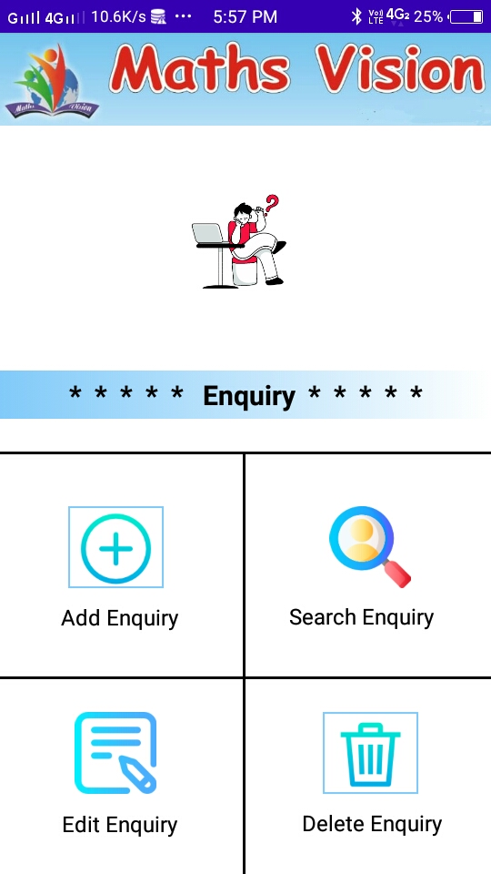

# Maths-Vision
Freelancing Project : It is an android application which manage the records and data of a coaching classes.

This app is used to handle all the type of necessary data of a coaching class whose name is Maths Vision. 

## Application Screenshots :-

